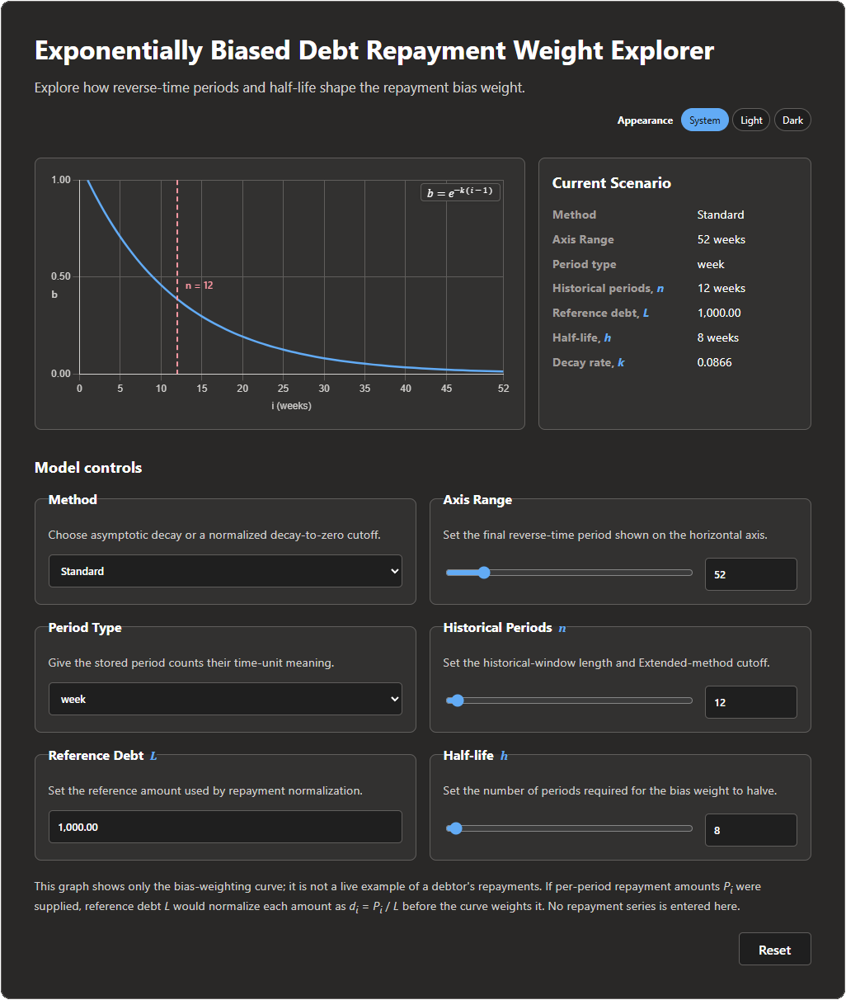

# **Exponentially Biased Debt Repayment Weight** Parameter Explorer

## 🔎 Overview

### Parameter Explorer

This [parameter explorer](https://rohingosling.github.io/exponentially-biased-debt-repayment-weight/app/) serves as a companion tool for the [Exponentially Biased Debt Repayment Weight](https://papers.ssrn.com/sol3/papers.cfm?abstract_id=7116959) technical note.

### Technical Note

The [Exponentially Biased Debt Repayment Weight](https://papers.ssrn.com/sol3/papers.cfm?abstract_id=7116959) technical note defines an exponentially biased debt repayment weight, a closed-form method for ranking indebted users based on repayment history. Each repayment is normalized by a fixed reference debt amount and weighted by an exponential recency function, producing a transparent score that emphasizes recent repayment behavior while retaining a controlled contribution from older history.

- The standard form of the method uses an asymptotic exponential decay function.
- An extended form of the method introduces boundary-condition coefficients that force the decay function to reach exactly zero at a specified cutoff period.

The method requires no model training, labelled outcomes, demographic features, or third-party behavioral data. It is presented as an independent, non-peer-reviewed technical note and should be understood as a repayment-ranking heuristic rather than a calibrated credit-risk model.

## 🛠️ Resources

- [Exponentially Biased Debt Repayment Weight (PDF)](docs/paper/exponentially-biased-debt-repayment-weight.pdf)
- [Companion Parameter Explorer](https://rohingosling.github.io/exponentially-biased-debt-repayment-weight/app/)
- [Medium Article](https://medium.com/@rohingosling/a-simple-way-to-rank-repayment-behavior-with-exponential-decay-d96702d0a270)
- For the sake of entertainment, [Original white board explanation](docs/reference/whiteboard/decay-function-1.0.pdf)
